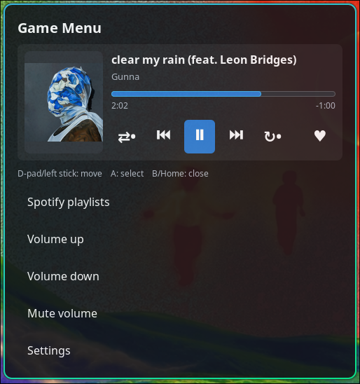

# Hyprland Gamepad Menu

A controller-friendly overlay for Hyprland gaming and couch media setups.

Open a GTK menu from your controller Home/Guide button, control Spotify, launch Steam Big Picture, take screenshots, adjust the active audio sink, and keep a lightweight TV mode available without opening the full menu.



## Why

Hyprland is excellent for gaming setups, but controller-first desktop controls still take wiring: media keys, Bluetooth volume targeting, Steam Big Picture, Spotify playlists, and a quick overlay that does not leak inputs into the running game.

This project packages that workflow into one small Python/GTK menu plus a listener.

## Features

- Opens from a controller Home/Guide button.
- Controller navigation: D-pad or left stick to move, A to select, B/Home to go back or close.
- Exclusively grabs the controller while open, so background games do not also receive menu inputs.
- Spotify now-playing panel with cover art, title, artist, progress, elapsed time, and remaining time.
- Spotify Liked Songs heart button for the current track.
- Spotify playlist picker with cover thumbnails, paged 8 playlists at a time.
- Spotify play modes: shuffle and repeat off/track/playlist.
- Settings screen for hiding menu actions and enabling auto key presses on open.
- Auto pause sends `Escape` to the focused game before opening the overlay.
- Auto space sends `Space` to the focused game before opening the overlay.
- TV mode lets the controller control playback without opening the overlay: D-pad up/down adjusts volume, with an optional A/X-to-Space toggle for controllers that do not send Space themselves.
- Volume controls target the running audio sink first, so Bluetooth headphones can work even when the PipeWire default sink still points somewhere else.

## Status

This is an early personal setup tool. It works on the author's Hyprland setup and currently ships with Zikway-style controller defaults. Wider controller support is planned, but for now non-Zikway controllers may need button/device constants edited in the scripts.

Good next improvements:

- Configurable controller mapping instead of editing Python constants.
- Demo GIF and screenshots.
- AUR package or packaging instructions.
- Explicit license file.

## Requirements

- Hyprland
- Python 3
- GTK 3 Python bindings: `python-gobject` / `python-gi`
- `playerctl`
- `wpctl` from WirePlumber/PipeWire
- `pactl` from PulseAudio/PipeWire Pulse compatibility tools
- `wtype` for auto pause on open
- `grim`, `slurp`, and `wl-copy` for screenshots
- `steam` for the Steam Big Picture action
- A Linux joystick device such as `/dev/input/js0`
- Read access to the controller event device for exclusive input grabbing

This project currently defaults to a Zikway-style controller path:

```text
/dev/input/by-id/usb-Zikway_HID_gamepad-joystick
/dev/input/by-id/usb-Zikway_HID_gamepad-event-joystick
```

For another controller, edit `GAMEPAD`, `GAMEPAD_EVENT`, `HOME_BUTTON`, and button/axis constants in `bin/game-menu` and `bin/gamepad-menu-listener`.

## Install

```bash
git clone https://github.com/skur-the-plug/hyprland-gamepad-menu.git
cd hyprland-gamepad-menu
./install.sh
```

The installer places:

```text
~/.local/bin/game-menu
~/.local/bin/gamepad-menu-listener
~/.local/bin/sync-spotify-playlists
```

Add the contents of `hypr/hyprland.conf` to `~/.config/hypr/hyprland.conf`, then reload Hyprland:

```bash
hyprctl reload
```

You can also test the menu from the keyboard with:

```text
SUPER+G
```

## Spotify Playlists

Spotify Desktop/playerctl can control playback and expose current track metadata, but it does not expose your full playlist library. To show your own playlists, sync them through Spotify Web API.

1. Create a Spotify app at `https://developer.spotify.com/dashboard`.
2. Enable **Web API**.
3. Add this redirect URI:

```text
http://127.0.0.1:8888/callback
```

4. Copy the app's Client ID and run:

```bash
sync-spotify-playlists --client-id YOUR_SPOTIFY_CLIENT_ID
```

The sync command uses Spotify Authorization Code with PKCE, asks for playlist-read and library read/write scopes, and writes:

```text
~/.config/gamepad-menu/playlists.json
```

The menu reads that file and displays playlists under `Spotify playlists`.
The heart button uses the same Spotify token to add or remove the current track from Liked Songs. If you authorized before the heart feature existed, run:

```bash
sync-spotify-playlists --reauth
```

You can also maintain the file manually:

```json
[
  {
    "name": "My playlist",
    "uri": "spotify:playlist:YOUR_PLAYLIST_ID",
    "cover_url": "https://i.scdn.co/image/..."
  }
]
```

See `examples/playlists.json` for a starter file.

## Settings

The menu writes settings to:

```text
~/.config/gamepad-menu/settings.json
```

Available settings in the UI:

- `Auto pause on open`: sends `Escape` to the focused game before opening the overlay.
- `Auto space on open`: sends `Space` to the focused game before opening the overlay. Turning this on disables auto pause, so only one key is sent.
- `TV mode`: while enabled, D-pad up/down adjusts volume without opening the overlay.
- `TV mode A/X sends Space`: optionally injects Space from A/X for controllers that do not already send Space themselves. Leave this off if A/X already pauses playback.
- `Show ...`: toggles which actions appear in the main menu.

## Controls

- Home/Guide: open menu from the listener; close when already inside the menu.
- D-pad/left stick: move selection.
- A: activate selected action.
- B: back from submenus, close from the main menu.

## Notes

- Auto key presses are game-dependent. Many PC games pause/open their menu on `Escape`; some do not.
- Online games may keep running server-side even if their local pause menu opens.
- Playlist covers are loaded only for the visible page to keep the overlay responsive with large playlist libraries.
